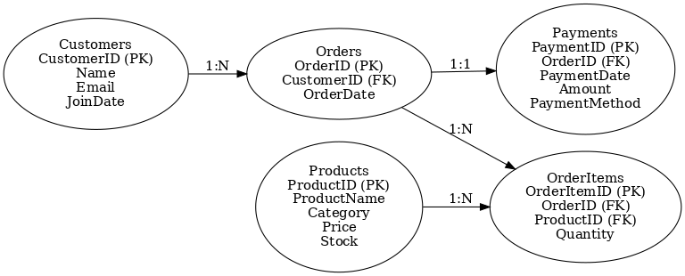

# 🛒 Retail Store SQL Project

A complete SQL portfolio project that simulates a small retail store's database, covering customer orders, products, payments, and inventory management. This project includes a relational schema, ER diagram, and useful analytical queries that demonstrate real-world SQL skills.

---

## 📁 Project Structure

```
retail-store-sql-project/
├── retail_sql_schema.sql        # SQL script to create tables and insert sample data
├── retail_sql_er_diagram.png    # Visual ER diagram
├── README.md                    # Project documentation (this file)
```

---

## 🧱 Database Schema

### Tables Included:
- **Customers** – Customer info and join dates
- **Products** – Product catalog with pricing and stock
- **Orders** – Customer orders
- **OrderItems** – Items in each order
- **Payments** – Payment details linked to orders

Relational integrity maintained via foreign keys.

---

## 🔗 ER Diagram



---

## 📜 Sample SQL Queries

Here are examples of useful SQL analytics:

```sql
-- Total Revenue:
SELECT SUM(Amount) AS TotalRevenue FROM Payments;

-- Most Sold Products:
SELECT P.ProductName, SUM(OI.Quantity) AS TotalSold
FROM OrderItems OI
JOIN Products P ON OI.ProductID = P.ProductID
GROUP BY P.ProductName
ORDER BY TotalSold DESC;

-- Monthly Revenue:
SELECT MONTH(PaymentDate) AS Month, SUM(Amount) AS Revenue
FROM Payments
GROUP BY MONTH(PaymentDate);
```

---

## 🎯 What This Project Demonstrates

- ER diagram design
- SQL DDL and DML skills
- Joins, aggregations, and grouping
- Realistic business database modeling
- Resume-ready SQL project

---

## 🧑‍💻 How to Run This Project

1. Open **MySQL Workbench** (or any SQL IDE)
2. Copy and run `retail_sql_schema.sql`
3. Query the tables or use the sample queries above

---

## 📌 Author

**Rajwardhan Malhari Pawar**  
SQL Developer | Mechanical Engineer | Tech Enthusiast

📧 Email: rajwardhanpawar0707@gmail.com  
🌐 GitHub: [rajwardhan1907](https://github.com/rajwardhan1907)

---

## ⭐ GitHub Tips

- Fork the project to experiment
- Add custom queries or visualizations
- Connect this with Power BI or Excel for dashboarding

---

## 📂 License

This project is open source and free to use for educational or portfolio purposes.
